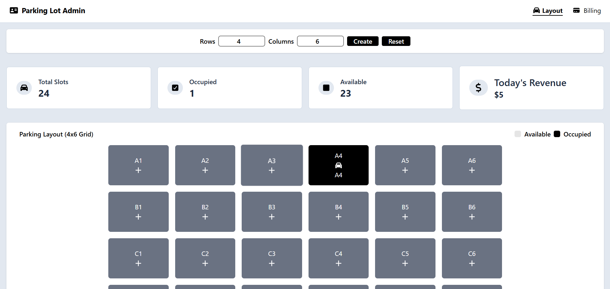
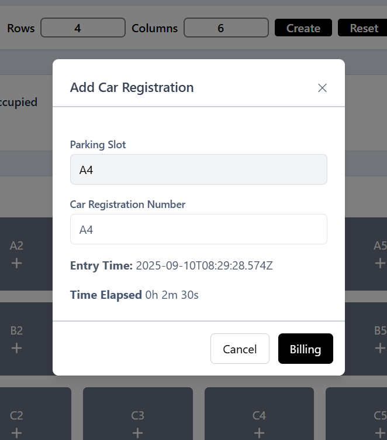
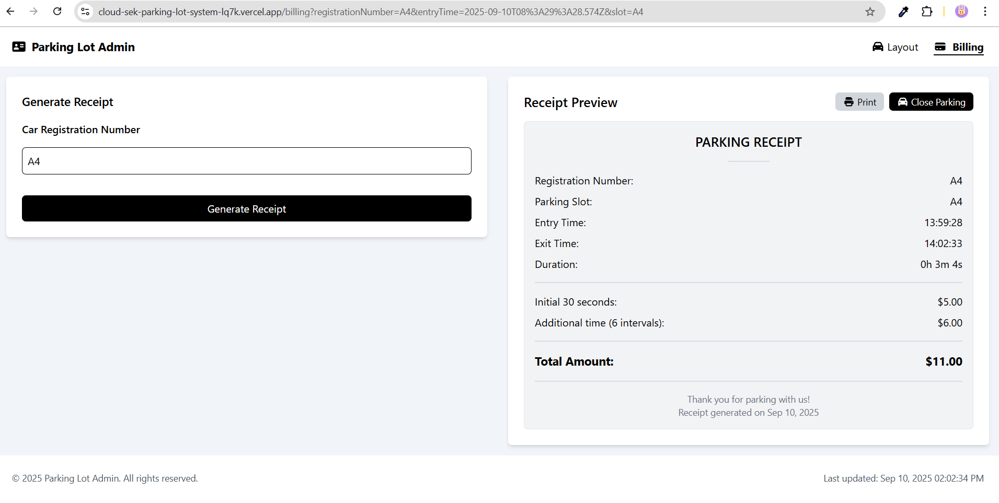

# Parking Lot Admin Interface

## Problem Statement
Welcome to the Parking Lot Admin Interface!  
The objective of this project is to build a **functional web application** that acts as an admin panel for the efficient management of a parking lot.  

The application provides core features such as **parking slot allocation** and **bill settlement**, utilising ReactJS components with fully client-side logic.  
No backend is required.

---

## Features

### Parking Layout Page
- Fixed **4x6 grid** parking layout.
- **Slot Assignment**: Assign cars to empty slots by entering the car’s registration number.
- **Occupied Slots**: Display car’s registration number, entry time, and time elapsed since allocation.
- **Revenue Tracking**: Total revenue updates when a slot is closed.

### Billing Page
- **Receipt Preview**: Generate a receipt after entering a registration number.
- **Billing Logic**:
  - Initial **30 seconds → $5**
  - Every additional **10 seconds → $1**
- **Close Parking**: Remove a car from its slot, making the slot available for reassignment.

---

## Screenshots

### Parking Layout

### Car Registration

### Billing Page

---

## Tech Stack
- ReactJS (Vite)
- Redux Toolkit
- React Router DOM
- Tailwind CSS

---

